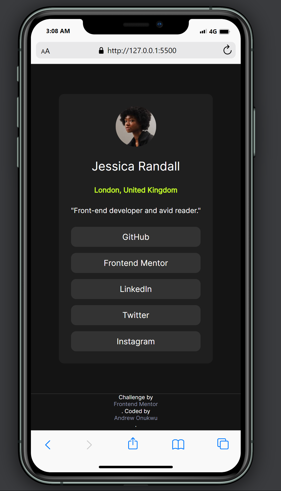
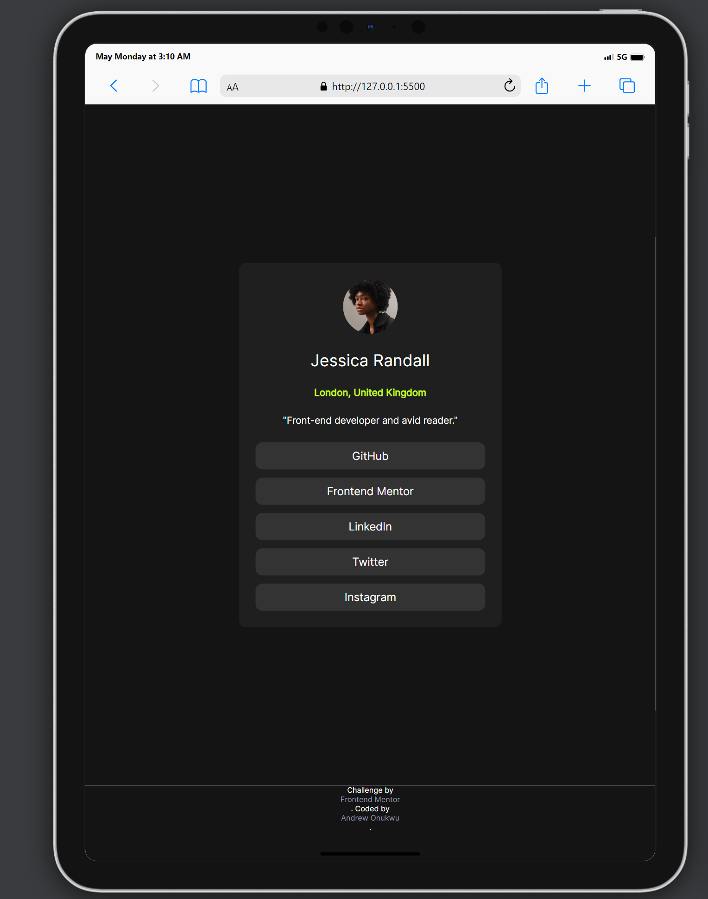
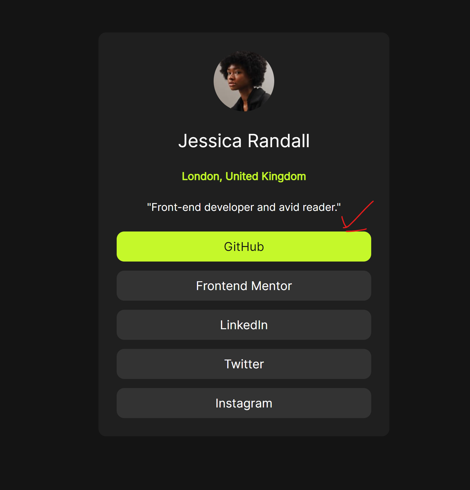
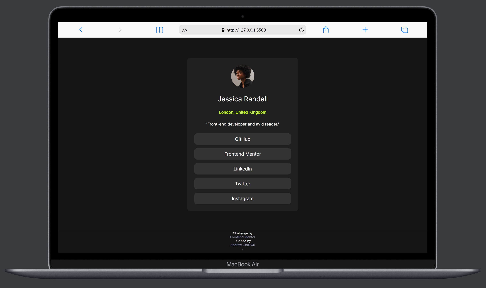

# Frontend Mentor - Social links profile solution

This is a solution to the [Social links profile challenge on Frontend Mentor](https://www.frontendmentor.io/challenges/social-links-profile-UG32l9m6dQ). Frontend Mentor challenges help you improve your coding skills by building realistic projects. 

## Table of contents

- [The challenge](#the-challenge)
  - [Screenshot](#screenshot)
  - [Links](#links)
- [My process](#my-process)
  - [Built with](#built-with)
  - [What I learned](#what-i-learned)
  - [Continued development](#continued-development)
- [Author](#author)
- [Acknowledgments](#acknowledgments)

## Overview

### The challenge

Users should be able to:

- See hover and focus states for all interactive elements on the page

### Screenshot

### Links

- Solution URL: [Link to the solution here](https://github.com/andychuks51/social-links-profile-main)
- Live Site URL: [Link to the live site here](https://andychuks51.github.io/social-links-profile-main/)

## My process

### Built with

- Semantic HTML5 markup
- CSS custom properties
- Flexbox
- Mobile-first workflow

### What I learned

This was basically a simple approach as I continue to refine my skills

### Continued development

Not some much changed since the last challenge, need more precise with making layout

## Author

- Frontend Mentor - [@andy.chuks51](https://www.frontendmentor.io/profile/andychuks51)
- Twitter - [@drew_techie](https://x.com/drew_techie?t=OLuFzJqb8nFG57BscrejOA&s=09)

## Acknowledgments

firstly I'm grateful to almighty God for giving me the opportunity to complete this challenge.
